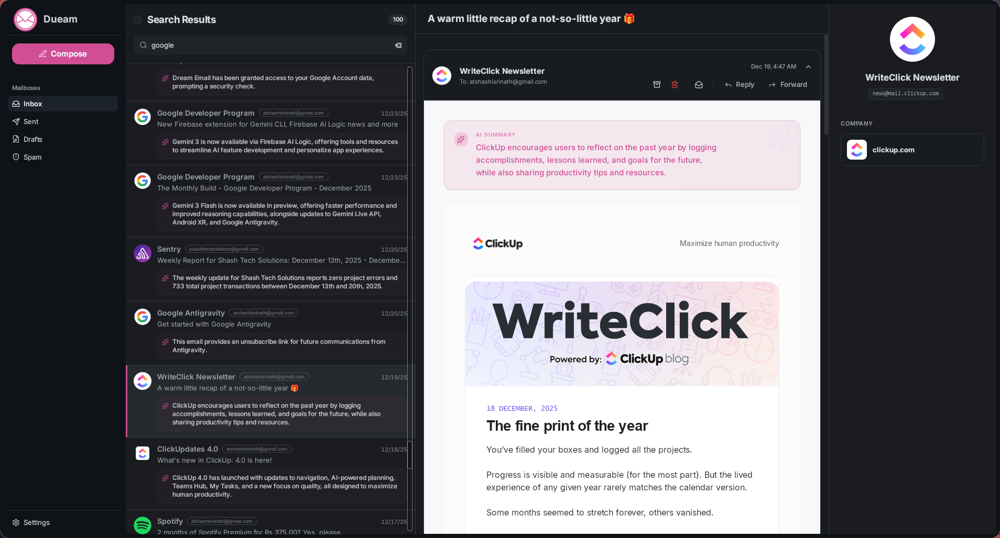
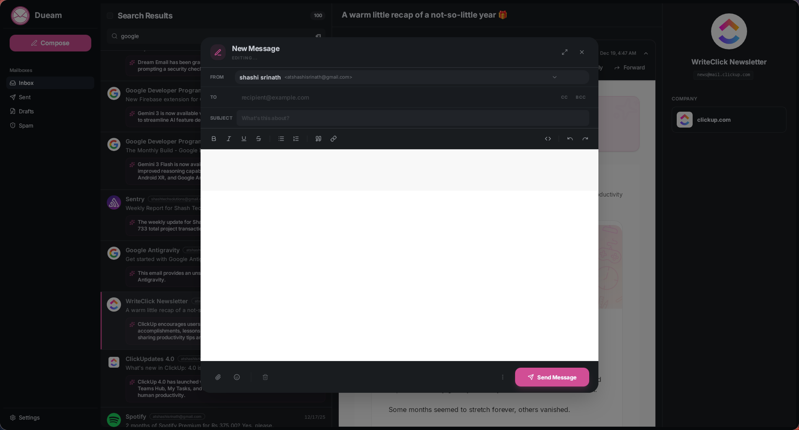
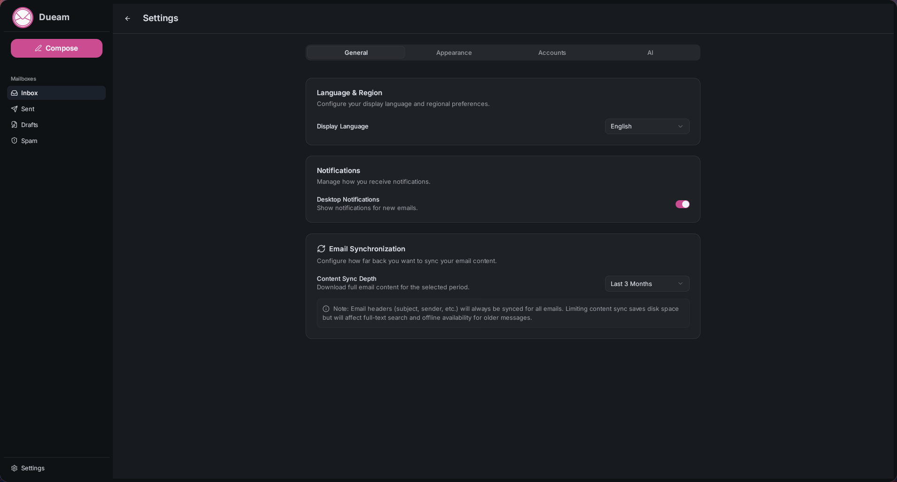

# Dueam

Dueam is a modern, high-performance desktop email client built for speed, privacy, and intelligence. It combines a beautiful React-based interface with a robust Rust backend to provide a seamless email experience across all your accounts.



## ✨ Key Features

- **Multi-Account Support**: Manage Google and custom IMAP/SMTP accounts in one interface.
    - *Note: Microsoft 365/Outlook support is currently in active development and considered experimental.*
- **Privacy-First Architecture**: Your emails are stored and indexed locally in a SQLite database. No third-party servers sit between you and your mail provider.
- **AI-Powered Intelligence**:
    - **Smart Summarization**: Get instant summaries of long email threads using local or cloud-based LLMs (Gemma 3).
    - **Sender Enrichment**: Automatically discover social profiles, company information, and professional bios for your contacts.
- **Fast Search**: Powered by SQLite FTS5, find any email within your local database instantly.
- **Beautiful & Customizable**:
    - Multiple built-in themes (Nord, Rose Pine, Dracula, and more).
    - Granular control over UI density, font families, and accent colors.
- **Rich Compose Experience**: A powerful composer powered by Tiptap with full formatting and attachment support.

## 📸 Screenshots

### The Intelligent Inbox
A clean view of your conversations with AI-generated snippets and enriched sender details.


### Email Composition
A powerful composer powered by Tiptap with full formatting and attachment support.


### Personalization & Settings
Customization of themes, density settings, and AI configuration.


## 🛠 Tech Stack

- **Frontend**: [React 19](https://react.dev/), [TanStack Router & Query](https://tanstack.com/), [Zustand](https://zustand-demo.pmnd.rs/), [Tailwind CSS v4](https://tailwindcss.com/)
- **Backend**: [Rust](https://www.rust-lang.org/), [Tauri v2](https://v2.tauri.app/)
- **Database**: [SQLite](https://www.sqlite.org/) with [SQLx](https://github.com/launchbadge/sqlx)
- **AI**: [langchain-rust](https://github.com/napi-rs/langchain-rust) and [Gemma 3](https://huggingface.co/google/gemma-3-27b)
- **Email Protocols**: `email-lib` and `imap-client` (Rust)

## 🚀 Getting Started

### Prerequisites

- [Rust](https://www.rust-lang.org/tools/install)
- [Bun](https://bun.sh/)
- Build tools for your OS (see [Tauri prerequisites](https://v2.tauri.app/start/prerequisites/))

### Development

1. **Clone the repository**:
   ```bash
   git clone https://github.com/yourusername/dueam.git
   cd dueam
   ```

2. **Install dependencies**:
   ```bash
   bun install
   ```

3. **Run in development mode**:
   ```bash
   bun dev:full
   ```

### Building for Release

To build a production-ready package for your OS:

```bash
# Linux (Debian/RPM)
bun build:linux

# General Tauri Build
bun tauri build
```

The resulting binaries will be located in `src-tauri/target/release/bundle/`.

## 📄 License

This project is licensed under the MIT License - see the [LICENSE](LICENSE) file for details.